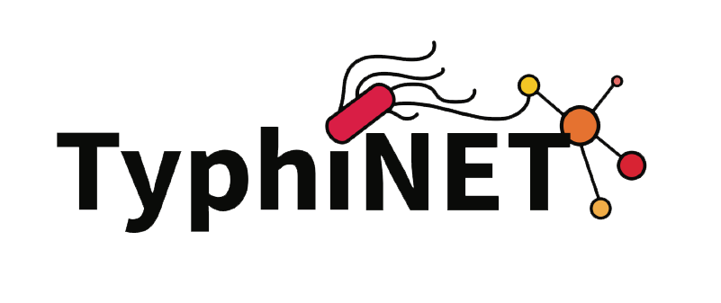

# TyphiNET web dashboard


## Table of Contents

- [Description](#Description)
- [Installation](#Installation)
- [Funding & acknowledgements](#Acknowledgements)

## Description

TyphiNET is a dashboard for visualising global _Salmonella_ Typhi genotype and antimicrobial resistance data. Our interface allows you to search for specific data on individual countries and over specific time periods. Data are regularly updated (last updated/curation on February 03th, 2023) from [Pathogenwatch](https://pathogen.watch/).

TyphiNET is available at: http://typhi.net

## Installation (for software development purposes only, please visit http://typhi.net for all other purposes)

#### 1. Install <a href="https://git-scm.com/">GIT</a>, <a href="https://www.npmjs.com/get-npm">NPM</a> and <a href="https://www.mongodb.com/try/download/community?tck=docs_server">MongoDB</a>

`Note: While installing MongoDB, check the option to install MongoDB Compass. If there's no option, you can download it here:` <a href="https://www.mongodb.com/try/download/compass">MongoDB Compass</a>

#### 2. Install YARN with the command

```sh
npm install -g yarn
```

#### 3. On the command line, run the commands

```sh
git clone https://github.com/zadyson/TyphiNET.git
```

#### 4. Inside the project, folder run this command to install the server dependencies

```sh
npm install
```

#### 5. Inside the folder `/client`, run the previous command to install the client dependencies

#### 6. Inside the project folder, create a file named `.env`. Inside it, copy the following code

```sh
MONGO_URI= (see item 7 from the manual)
MONGO_URI_ATLAS=(see item 7 from manual to access MongoDB Atlas cloud)
```

#### 7. When opening MongoDB Compass, you will see a white box with a connection string. Copy this string and paste it on the variable `MONGO_URI`. After clicking the `Connect` button

#### 8. Finally, inside the project folder, run the command and wait for the program to open on your browser

```sh
yarn start: prod
```

## Funding & acknowledgements

The TyphiNET dashboard is coordinated by Dr Zoe Dyson, Dr Louise Cerdeira & Prof Kat Holt at the London School of Hygiene and Tropical Medicine & Monash University. This project has received funding from the Wellcome Trust (Open Research Fund, 219692/Z/19/Z) and the European Union's Horizon 2020 research and innovation programme under the Marie Sklodowska-Curie grant agreement No 845681. 
